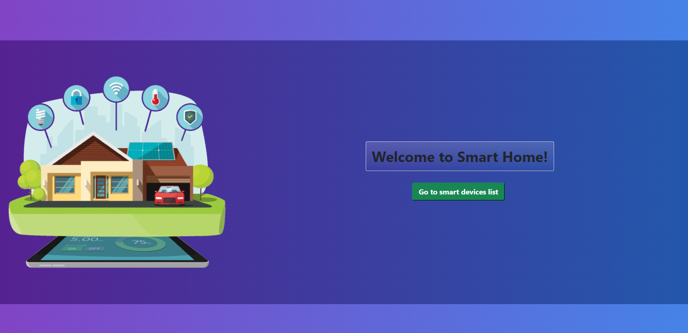
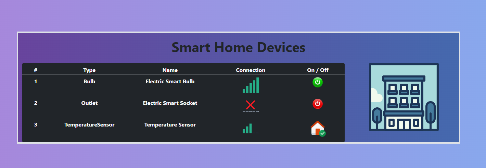
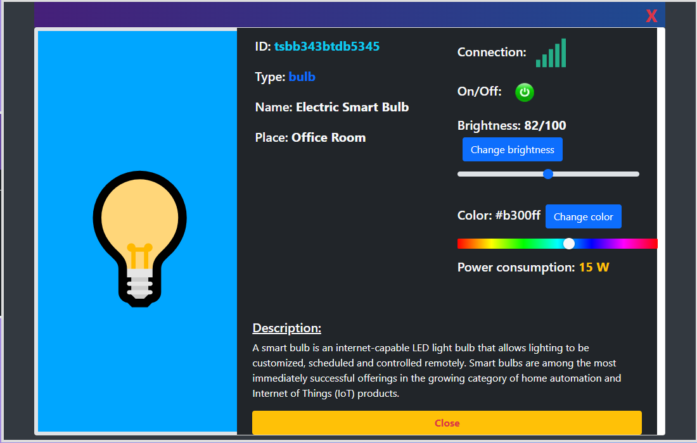

# 🤖 Smart Home Interface 🤖








## There are three types of devices plugged into the interface
    
### - Bulb
### - Outlet
### - Temperature sensor

### ToDo List: 
- [x] Main screen should include list of devices plugged into the system with basic info: type, name, state of 
  connection.
- [x] After click on the element (specific device) there should pop out window with visualization of device state
- [x] Window should support dragging with interact.js library -> React RnD
- [x] Window should not block chose of another device
- [x] If we change the device, the window should stay, but the data should be replaced for new device
- [x] After closing and new opening window should appear in the same place as last time 
- [x] Devices state should be updated in-live,  with REST (every 500ms) periodic queries or WebSocket protocol


Backend API: JSON-Server

  ```
  GET /api/v1/devices => zwraca SmartDevice[];
  GET /api/v1/devices/{deviceId} => zwraca SmartDeviceDetails;
  GET /api/v1/refresh - endpoint typu WebSocket;
    ```
